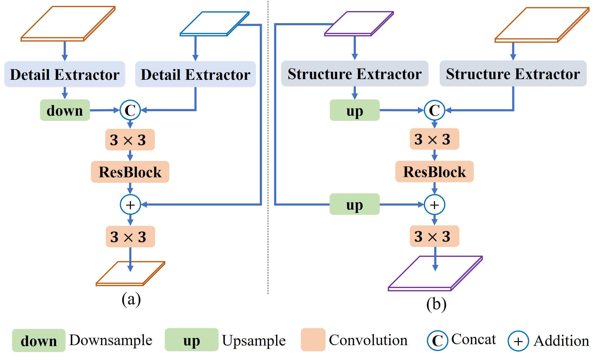

# FENet(ChinaMM-2022-oral)
Reproduced Implementation of Our ChinaMM 2022 oral paper: Boosting Semantic Segmentation via Feature Enhancement.

**FENet achieves 80.1 mIoU and 82.0 mIoU with ResNet18 and ResNet101 as backbone respectively on Cityscape validation set!**


An analogy between image enhancement and feature enhancement.
  (a) displays the original image, the image after sharpening, and the image after structure-preserving smoothing from top to bottom. (b) and (c) show the intermediate features and final segmentation results using different feature enhancement operations all with the original image (top-left corner) in (a) as input. 


The proposed FEM-D and FEM-S are given in left and right, respectively. 


## This project is adapted from [SFNet](https://github.com/lxtGH/SFSegNets), thank the author for his excellent work.


## DataSet Setting
Please see the DATASETs.md for the details.


## Requirements

pytorch >= 1.3.0
apex
opencv-python


## Demo 

### Visualization Results

python demo_folder.py --snapshot ckpt_path --demo_floder images_folder --save_dir save_dir_to_disk


## Training 

The train settings require 8 GPU with at least **11GB** memory. 
Please download the pretrained models before training.

Train ResNet18 model
```bash
sh ./scripts/train_cityscapes_fenet_res18.sh
```

Train ResNet101 models

```bash
sh ./scripts/train_cityscapes_fenet_res101.sh
```

## Submission for test 

```bash
sh ./scripts/submit_test/submit_cityscapes_fenet_res101.sh
```


## Citation
If you find this repo is useful for your research, Please consider citing these papers:


```
@article{zhi2022boosting,
  title={Boosting Semantic Segmentation via Feature Enhancement},
  author={Liu, Zhi and Zhang, Yi and Guo, Xiaojie},
  year={2022}
}

@inproceedings{sfnet,
  title={Semantic Flow for Fast and Accurate Scene Parsing},
  author={Li, Xiangtai and You, Ansheng and Zhu, Zhen and Zhao, Houlong and Yang, Maoke and Yang, Kuiyuan and Tong, Yunhai},
  booktitle={ECCV},
  year={2020}
}
```


